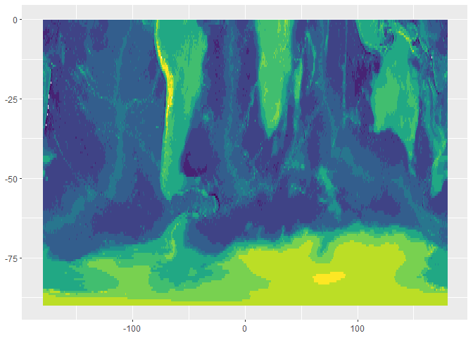
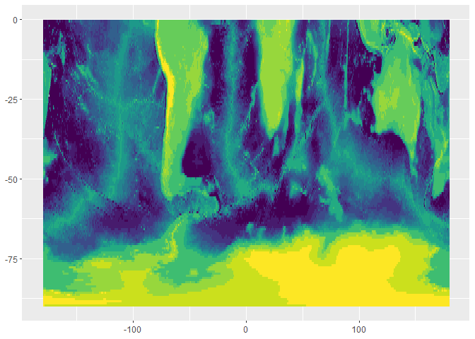
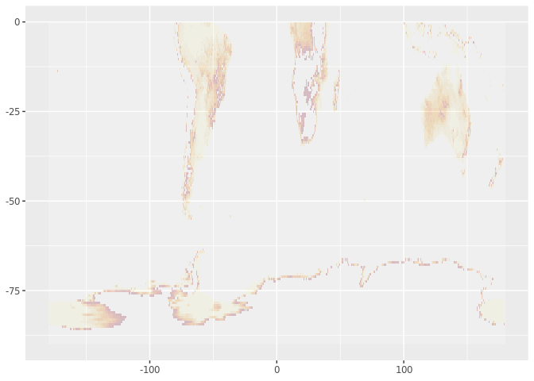
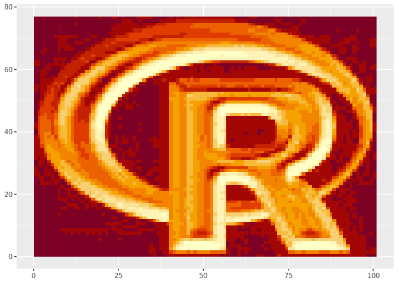
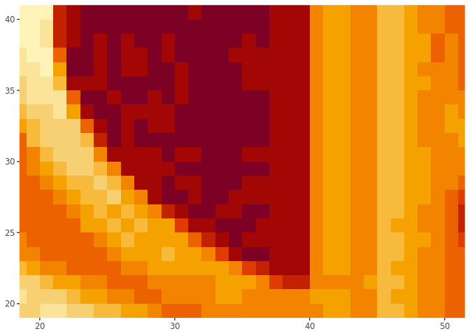
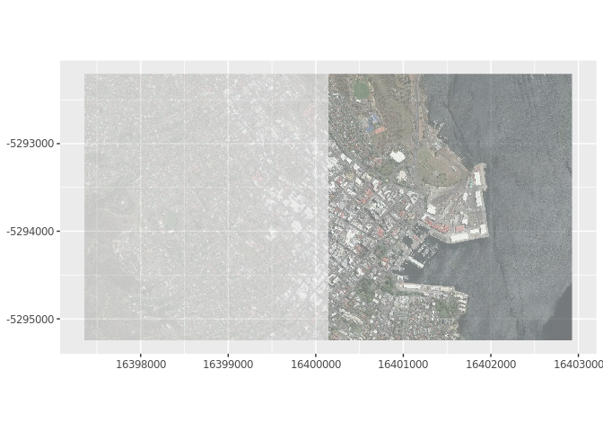

<!-- README.md is generated from README.Rmd. Please edit that file -->

# plusraster

<!-- badges: start -->

<!-- badges: end -->

The goal of plusraster is to fast plot raster images in ggplot2. There
is a `plus_raster()` function that works like `image()` for single-layer
rasters or like `plotRGB()` for 3 or 4 layer rasters. Because we use
raster annotation, we must set the xlim and ylim separately (or have it
already set up by other data).

(I’m still working my way around gg layers, surely we can grab the
extent to do this and/or inherit from the input gg upstream).

## Installation

You can install the development version:

``` r
## install.packages("remotes")
remotes::install_github("mdsumner/plusraster")
```

## Example

``` r
library(plusraster)
library(raster)
#> Loading required package: sp
library(ggplot2)

topo <- quadmesh::etopo

gg <- ggplot() + xlim(-180, 180) + ylim(-90, 0)

gg + plus_raster(topo, col = viridis::viridis(100), breaks = seq(-8000, 5000, length.out = 12)) 
#> NOTE: rgdal::checkCRSArgs: no proj_defs.dat in PROJ.4 shared files
```



``` r
gg + plus_raster(topo, col = viridis::viridis(100), breaks = quantile(topo, seq(0, 1,length.out = 15))) 
#> NOTE: rgdal::checkCRSArgs: no proj_defs.dat in PROJ.4 shared files
```



``` r

gg + plus_raster(topo, breaks = seq(0, 1000, length.out = 10), alpha = 0.2)
#> NOTE: rgdal::checkCRSArgs: no proj_defs.dat in PROJ.4 shared files
```



``` r


f <- system.file("external/rlogo.grd", package="raster")
ggplot() + plus_raster(lazyraster::lazyraster(f)) + xlim(0, 101) + ylim(0, 77)
```



``` r

ggplot() + plus_raster(raster(f), interpolate = FALSE) + xlim(20, 50) + ylim(20, 40)
#> NOTE: rgdal::checkCRSArgs: no proj_defs.dat in PROJ.4 shared files
#> NOTE: rgdal::checkCRSArgs: no proj_defs.dat in PROJ.4 shared files
```


``` r
## underlying rasterImage interpolation is available
ggplot() + plus_raster(raster(f), interpolate = TRUE) + xlim(20, 50) + ylim(20, 40)
#> NOTE: rgdal::checkCRSArgs: no proj_defs.dat in PROJ.4 shared files
#> NOTE: rgdal::checkCRSArgs: no proj_defs.dat in PROJ.4 shared files
```



``` r


library(ceramic)

## you need your own key here
## ceramic_key <- "<your key>" ## see ?ceramic::get_api_key
Sys.setenv(MAPBOX_API_KEY=ceramic_key)

cc <- cc_location(raster::extent(147.3, 147.35, -42.89, -42.87), zoom = 15)
#> NOTE: rgdal::checkCRSArgs: no proj_defs.dat in PROJ.4 shared files
#> Preparing to download: 18 tiles at zoom = 15 from 
#> https://api.mapbox.com/v4/mapbox.satellite/
#> NOTE: rgdal::checkCRSArgs: no proj_defs.dat in PROJ.4 shared files
#> NOTE: rgdal::checkCRSArgs: no proj_defs.dat in PROJ.4 shared files
#> NOTE: rgdal::checkCRSArgs: no proj_defs.dat in PROJ.4 shared files
g2 <- ggplot() + xlim(raster::xmin(cc), 
                      raster::xmax(cc)) + ylim(raster::ymin(cc), raster::ymax(cc)) + 
  plus_raster(cc, alpha = 0.9) + 
  coord_equal()
print(g2)
```



``` r

## transparency can be per cell, but note this is transpose/flip orientation 
g3 <- ggplot() + xlim(raster::xmin(cc), 
                      raster::xmax(cc)) + ylim(raster::ymin(cc), raster::ymax(cc)) + 
  plus_raster(cc, alpha = rep(c(0.2, 0.6), each = ncell(cc)/2)) + 
  coord_equal()
print(g3)
```


-----

Please note that the ‘plusraster’ project is released with a
[Contributor Code of
Conduct](https://github.com/mdsumner/plusraster/blob/master/CODE_OF_CONDUCT.md).
By contributing to this project, you agree to abide by its terms.
