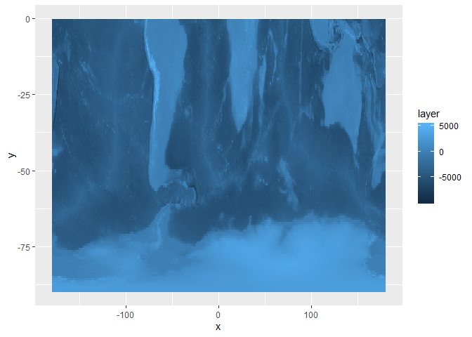
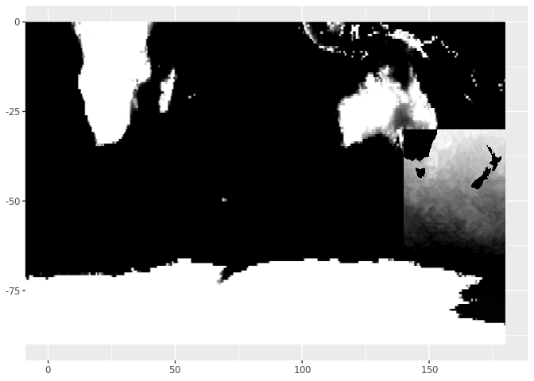

<!-- README.md is generated from README.Rmd. Please edit that file -->

# plusraster

<!-- badges: start -->

<!-- badges: end -->

The goal of plusraster is to fast plot raster images in ggplot2. There
is a `plus_raster()` function that works like `image()` for single-layer
rasters or like `plotRGB()` for 3 or 4 layer raster.

## Installation

You can install the development version:

``` r
## install.packages("remotes")
remotes::install_github("mdsumner/plusraster")
```

## Example

This sections shows how compellingly fast raster gg can be, the problem
usually is having to expand every single pixel coordinate into a data
frame, just so this can be compressed into the four numbers defining the
extent before plotting. This code is bad, naive ggplot2.

``` r
library(plusraster)
library(raster)
library(ggplot2)

topo <- quadmesh::etopo

gg <- ggplot() + xlim(-180, 180) + ylim(-90, 0)

gg + plus_raster(topo, col = viridis::viridis(100), breaks = seq(-8000, 5000, length.out = 12)) 
#> NOTE: rgdal::checkCRSArgs: no proj_defs.dat in PROJ.4 shared files
```


``` r
gg + plus_raster(topo, col = viridis::viridis(100), breaks = quantile(topo, seq(0, 1,length.out = 15))) 
#> NOTE: rgdal::checkCRSArgs: no proj_defs.dat in PROJ.4 shared files
```


``` r

gg + plus_raster(topo, breaks = seq(0, 1000, length.out = 10), alpha = 0.2)
#> NOTE: rgdal::checkCRSArgs: no proj_defs.dat in PROJ.4 shared files
```


``` r


f <- system.file("external/rlogo.grd", package="raster")
# ggplot() + plus_raster(lazyraster::lazyraster(f)) + xlim(0, 101) + ylim(0, 77)

ggplot() + plus_raster(raster(f), interpolate = FALSE) + xlim(20, 50) + ylim(20, 40)
#> NOTE: rgdal::checkCRSArgs: no proj_defs.dat in PROJ.4 shared files
#> NOTE: rgdal::checkCRSArgs: no proj_defs.dat in PROJ.4 shared files
```


``` r
## underlying rasterImage interpolation is available
ggplot() + plus_raster(raster(f), interpolate = TRUE) + xlim(20, 50) + ylim(20, 40)
#> NOTE: rgdal::checkCRSArgs: no proj_defs.dat in PROJ.4 shared files
#> NOTE: rgdal::checkCRSArgs: no proj_defs.dat in PROJ.4 shared files
```


``` r


library(ceramic)

## you need your own key here
## ceramic_key <- "<your key>" ## see ?ceramic::get_api_key
Sys.setenv(MAPBOX_API_KEY=ceramic_key)

cc <- cc_location(raster::extent(147.3, 147.35, -42.89, -42.87), zoom = 15)
#> Warning in .couldBeLonLat(x, warnings = warnings): CRS is NA. Assuming it is
#> longitude/latitude
#> Preparing to download: 18 tiles at zoom = 15 from 
#> https://api.mapbox.com/v4/mapbox.satellite/
#> NOTE: rgdal::checkCRSArgs: no proj_defs.dat in PROJ.4 shared files
#> NOTE: rgdal::checkCRSArgs: no proj_defs.dat in PROJ.4 shared files
g2 <- ggplot() + xlim(raster::xmin(cc), 
                      raster::xmax(cc)) + ylim(raster::ymin(cc), raster::ymax(cc)) + 
  plus_raster(cc, alpha = 0.9) + 
  coord_equal()
print(g2)
```


``` r

## transparency can be per cell, but note this is transpose/flip orientation 
g3 <- ggplot() + xlim(raster::xmin(cc), 
                      raster::xmax(cc)) + ylim(raster::ymin(cc), raster::ymax(cc)) + 
  plus_raster(cc, alpha = rep(c(0.2, 0.6), each = ncell(cc)/2)) + 
  coord_equal()
print(g3)
```


## Timings

``` r
big <- quadmesh::etopo #raster::disaggregate(quadmesh::etopo, fact = 4)

system.time({
pr <- ggplot() + xlim(-180, 180) + ylim(-90, 0) + 
  plus_raster(big, col = colorRampPalette(scales::brewer_pal()(9)[9:5])(26))
                             print(pr)
})
#> NOTE: rgdal::checkCRSArgs: no proj_defs.dat in PROJ.4 shared files
```


    #>    user  system elapsed 
    #>   0.178   0.000   0.179
    
    
    
    system.time({
      dr <- ggplot(as.data.frame(big, xy = TRUE), aes(x, y, fill = layer)) + geom_raster()
      
      print(dr)
    })



    #>    user  system elapsed 
    #>   1.242   0.008   1.250

## VERY DEV

This section includes a real-ish new Geom, the understanding for which
was taking ruthlessly from statsmaths/ggimg. You give it a data frame of
files, and it invokes GDAL to find out their extent so it can plot them
as rasterGrobs.

It’s very good because it uses lazy-GDAL load to only read a reasonable
amount of pixels, this is completely general and can be used to fit any
set of pixels within any window and via a variety of interpolation
algorithms, from dozens of GDAL formats. Ultimately the ggplot should
tell GDAL how much and what window.

It’s not very good because it doens’t update the plot extent with the
coords you use in `draw_panel()`, but that’s easy to fix I think.

It’s also not very good because it doesn’t deal with missing values
(sentinel value) in the variety of GDAL rasters we can have, and doesn’t
detect the case of RGB imagery. Soon …

``` r

library(dplyr)
#> 
#> Attaching package: 'dplyr'
#> The following objects are masked from 'package:raster':
#> 
#>     intersect, select, union
#> The following objects are masked from 'package:stats':
#> 
#>     filter, lag
#> The following objects are masked from 'package:base':
#> 
#>     intersect, setdiff, setequal, union
library(ggplot2)

pngs <- system.file(file.path("extdata", c("file.png", "file2.png")), 
                    package = "plusraster", mustWork = TRUE)
## here's the magic, two geo-plots in geo-space and all we gave was the file names
d <- tibble::tibble(path= pngs)
ggplot(d[2:1, ]) + plusraster:::geom_gdal(aes(path = path)) + xlim(0, 180) + ylim(-90, 0)
```



``` r


#plusraster:::create_tiles(pngs) %>%
#  ggplot() + geom_rect(aes(xmin = xmin, xmax = xmax, ymin = ymin, ymax = ymax)
```

## VERY EXPERIMENTAL

``` r
ggplot(big) 
#> NOTE: rgdal::checkCRSArgs: no proj_defs.dat in PROJ.4 shared files
```


``` r

# some gg-sf problem on this machine (today)
#ggplot(big) + coord_equal() + geom_sf(data = sf::st_as_sf(raster::rasterToContour(big)))


ggplot(cc) + coord_equal()
```


``` r


ggplot(big) + xlim(100, 150)
#> NOTE: rgdal::checkCRSArgs: no proj_defs.dat in PROJ.4 shared files
#> Warning: Removed 4 rows containing missing values (geom_point).
```


``` r

## the dummy points get cropped so warning
ggplot(big) + coord_equal() + ylim(-70, -30) + xlim(150, 250)
#> NOTE: rgdal::checkCRSArgs: no proj_defs.dat in PROJ.4 shared files
#> Warning: Removed 4 rows containing missing values (geom_point).
```

## 

Please note that the ‘plusraster’ project is released with a
[Contributor Code of
Conduct](https://github.com/mdsumner/plusraster/blob/master/CODE_OF_CONDUCT.md).
By contributing to this project, you agree to abide by its terms.
